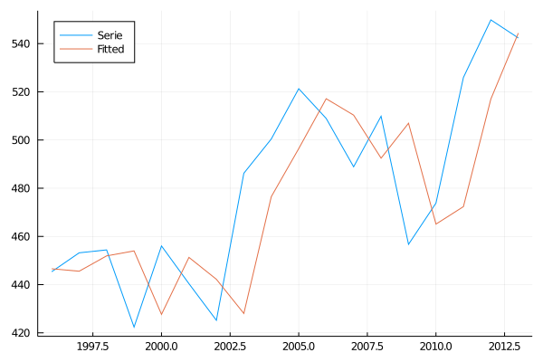
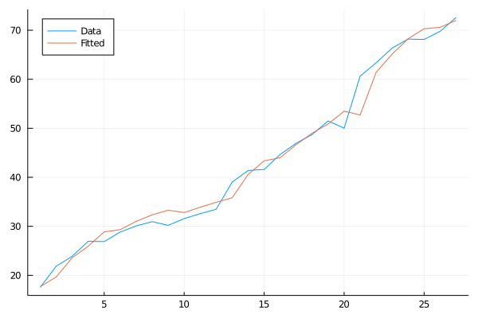
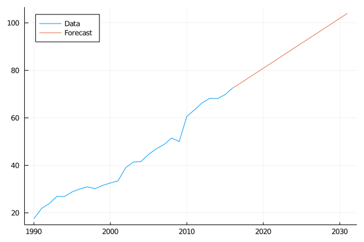
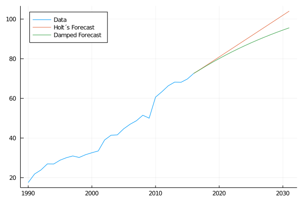
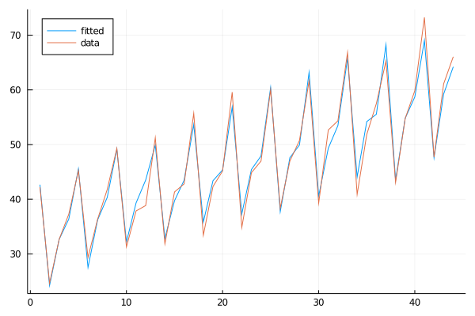

# TimeSeriesForecast.jl
---
## Exponential Smoothing 

**Functions:**

*Simple exponential smoothing:*

- SES(time_serie, α)

- SES_weight_loss(α, l0, time_serie)

- SES_weight(α, l0, time_serie)

*Holt’s linear trend method:*

- HLT(time_serie, α, β, l0, b0)

- HLT_loss(time_serie, α, β, l0, b0)

- HLT_forecast(time_serie, α, β, l0, b0, n_pred)

- Damped_HLT_loss(time_serie, α, β, l0, b0, ϕ)

- Damped_HLT_forecast(time_serie, α, β, l0, b0, ϕ, n_pred)

*Holt’s winter seasonal method:*

- HW_Seasonal_loss(time_serie, α, β, γ, l0, b0, s0, s1, s2, s3, m)

- HW_Seasonal(time_serie, α, β, γ, l0, b0, s0, m)

- HW_Seasonal_mult(time_serie, α, β, γ, l0, b0, s0, m)
---
## Example

[Notebook example](https://github.com/lambdaclass/julia_time_series_library/blob/main/exponential_smooth.jl.html)
